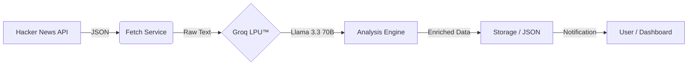

<div align="center">

# 🌊 DataFlow Systems
### Real-time Intelligence Pipeline

[](https://python.org)
[](https://fastapi.tiangolo.com)
[](https://groq.com)
[](https://vercel.com)
[](LICENSE)

<p align="center">
  
</p>

[**Live Demo**](https://your-vercel-app.vercel.app) · [**Report Bug**](https://github.com/jbanmol/fetch-analyse_sentiment/issues) · [**Request Feature**](https://github.com/jbanmol/fetch-analyse_sentiment/issues)

</div>

---

## ⚡ Overview

**DataFlow Systems** is a high-performance, autonomous data enrichment pipeline. It monitors live data sources, utilizes ultra-low latency AI inference to extract insights, and delivers structured intelligence to downstream applications.

Currently configured to track **Hacker News**, it filters noise and provides real-time sentiment analysis and summarization using **Llama 3.3 70B** on **Groq's LPU™ Inference Engine**.

## 🏗️ Architecture



## 🚀 Features

-   **🔥 Ultra-Fast Inference**: Leveraging Groq for near-instantaneous LLM responses.
-   **🛡️ Robust Data Pipeline**: Error-resilient fetching, parsing, and structured JSON output.
-   **✨ Modern Dashboard**: Glassmorphism UI for real-time monitoring and trigger control.
-   **🔌 API-First Design**: RESTful endpoints compatible with any frontend or automation tool.
-   **☁️ Serverless Ready**: Optimized for Vercel/Edge deployment.

## 📦 Installation

### Prerequisites
-   Python 3.10+
-   `uv` (recommended) or `pip`
-   Groq API Key

### Quick Start

1.  **Clone the repository**
    ```bash
    git clone https://github.com/jbanmol/fetch-analyse_sentiment.git
    cd fetch-analyse_sentiment
    ```

2.  **Install dependencies**
    ```bash
    uv sync
    # OR
    pip install -r requirements.txt
    ```

3.  **Configure Environment**
    Create a `.env.local` file:
    ```env
    GROQ_API_KEY=gsk_your_key_here
    ```

## 🖥️ Usage

### Development Server
Start the FastAPI server with hot-reload:
```bash
uv run uvicorn main:app --port 8000 --reload
```
Access the dashboard at **[http://localhost:8000](http://localhost:8000)**.

### API Endpoint
Trigger the pipeline programmatically:
```bash
curl -X POST "http://localhost:8000/process" \
     -H "Content-Type: application/json" \
     -d '{"email": "user@example.com", "source": "Hacker News"}'
```

## ☁️ Deployment

### Vercel
1.  Install Vercel CLI: `npm i -g vercel`
2.  Deploy to production:
    ```bash
    vercel --prod
    ```
3.  **Critical**: Add `GROQ_API_KEY` to Vercel's Environment Variables.

## 📄 License

Distributed under the MIT License. See `LICENSE` for more information.

<div align="center">
  <sub>Built with ❤️ by Anmol</sub>
</div>
